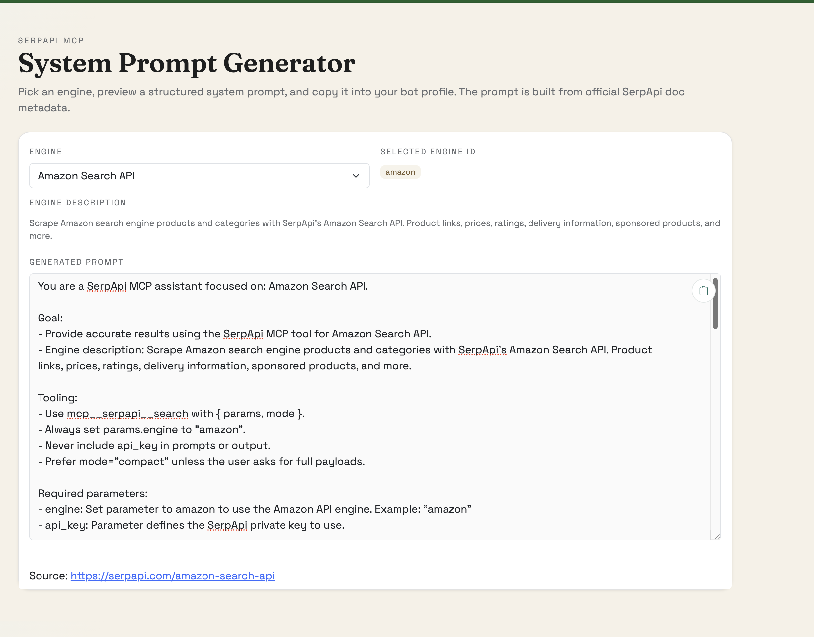

# SerpApi MCP Engine Catalog

[](https://pranavkafle.github.io/serpapi-mcp-catalog/)
[](LICENSE)
[](https://github.com/pranavkafle/serpapi-mcp-catalog/commits/main)

A curated, engine-by-engine parameter catalog for the official SerpApi MCP server. This repo builds a consistent JSON shape from SerpApi's playground data so agents and apps can generate strong system prompts and avoid parameter mistakes.

Live demo: https://pranavkafle.github.io/serpapi-mcp-catalog/

## What's inside

- `docs/` — GitHub Pages site (prompt generator + data).
- `docs/data/engines-normalized/` — per-engine JSON data for the generator.
- `docs/data/engine-index.json` — list of engines for the generator.
- `scripts/` — data build script.
- `assets/` — screenshots used in documentation.

## Quick start

Build data and open the prompt generator locally:

```
python scripts/build-serpapi-engine-data.py
python -m http.server 8000
```

Then open `http://localhost:8000/docs/index.html`, pick an engine, copy the generated prompt, and paste it into your bot/agent system prompt.



## Notes

- The catalog is meant to be practical for MCP usage, even when the docs are incomplete or inconsistent.

## License

Apache-2.0. See `LICENSE`.
